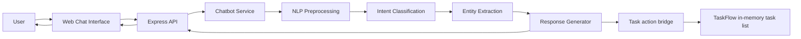

# NLP-Based Intelligent Chatbot Integrated with a Node.js and Express Web Application

A production-quality, runnable academic project: a rule/statistics-based NLP chatbot with a Node.js + Express backend and a vanilla HTML/CSS/JS frontend, designed so the NLP core can later be swapped for an ML/LLM model without touching the rest of the app.

---

## 1. Project Overview

This project implements a chatbot that:

1. Accepts a user's free-text message through a web chat UI.
2. Cleans and normalizes the text (NLP preprocessing).
3. Classifies the user's **intent** (what they want) using a Naive Bayes classifier.
4. Extracts useful **entities** (emails, order IDs, amounts, service names, dates).
5. Generates a context-aware reply, remembering the previous turn in the same session.
6. Performs supported TaskFlow task actions through a host callback when integrated with the main app.
7. Returns the reply, intent, confidence score, and action metadata as JSON over a REST API.

It is built to be **explainable and extensible** rather than a black box — every stage of the pipeline lives in its own file.

---

## 2. Features

- REST API (`POST /api/chat`, `GET /api/health`, `DELETE /api/chat/session`)
- Modular NLP pipeline: preprocessing → tokenization → intent classification → entity extraction → response generation
- 15 trainable intents + a fallback path for low-confidence/unknown input
- TaskFlow chatflows: add, list, complete, and delete tasks, including follow-up prompts for missing task names
- Handles paraphrased questions ("what time do you open" vs "when are you available")
- Lightweight spell-correction for minor typos (Levenshtein distance against the training vocabulary)
- Regex-based entity extraction (emails, phone numbers, order IDs, monetary amounts, dates, service names)
- Session-based conversation context (e.g. "how much does it cost?" after "what are your services?")
- Responsive chat UI: message bubbles, timestamps, typing indicator, clear-chat button, auto-resizing input, Enter-to-send
- Security: Helmet, CORS, rate limiting, input validation/sanitization, request size limits, no hardcoded secrets
- Jest + Supertest test suite covering NLP logic and the API surface
- Optional Gemini response polishing, strictly grounded in the local reference response and never used for task mutations
- Clear separation of concerns so the NLP engine can be swapped for a real ML/LLM model later

---

## 3. Technology Stack

| Layer          | Technology                                  |
|----------------|----------------------------------------------|
| Backend runtime| Node.js (>=18)                               |
| Web framework  | Express.js 4                                 |
| NLP            | `natural` (Bayes classifier, tokenizer, stemmer, Levenshtein distance) |
| Security       | `helmet`, `cors`, `express-rate-limit`       |
| Config         | `dotenv`                                     |
| Session IDs    | `uuid`                                       |
| Frontend       | HTML5, CSS3, vanilla JavaScript (no framework) |
| Testing        | `jest`, `supertest`                          |
| Dev tooling    | `nodemon`                                    |

The local NLP engine requires no external API. Gemini is optional and disabled unless `GEMINI_API_KEY` is configured.

---

## 4. System Architecture



Request lifecycle:

1. The browser sends `POST /api/chat` with `{ "message": "..." }` and an `x-session-id` header.
2. Express middleware (Helmet, CORS, rate limiter, JSON body parser, validator) processes the request.
3. `chatController` resolves the session ID and calls `chatbotService.processMessage()`.
4. `chatbotService` runs the full NLP pipeline and updates the session's context.
5. Recognized task actions call the host application's task callback; Gemini is skipped for mutations.
6. The controller returns JSON: `reply`, `intent`, `confidence`, `entities`, optional `task`/`changedTask`, and `sessionId`.
7. The frontend renders the reply. The integrated iframe notifies the parent page after a task mutation so the task list refreshes.

---

## 5. NLP Pipeline (How It Works)

```
raw text
   │
   ▼
[preprocessor.js]  lowercase → strip punctuation → tokenize → spell-correct → remove stopwords → stem
   │
   ▼
[intentClassifier.js]  Naive Bayes classification → intent + confidence
   │
   ▼
[entityExtractor.js]  regex-based extraction on the ORIGINAL text (emails, IDs, amounts, dates, services)
   │
   ▼
[responseGenerator.js]  pick a response template, adjusted by intent + entities + session context
   │
   ▼
reply (string) + metadata
```

Each stage is a separate file under `src/nlp/`, so any stage can be replaced independently (e.g. swap `intentClassifier.js` for a transformer-based classifier while keeping everything else the same).

---

## 6. Project Structure

```
nlp-chatbot/
│
├── package.json
├── server.js
├── .env
├── .env.example
├── .gitignore
├── README.md
│
├── src/
│   ├── routes/
│   │   └── chatRoutes.js
│   ├── controllers/
│   │   └── chatController.js
│   ├── services/
│   │   ├── chatbotService.js
│   │   ├── geminiClient.js
│   │   ├── sessionStore.js
│   │   └── taskActions.js
│   ├── nlp/
│   │   ├── preprocessor.js
│   │   ├── tokenizer.js
│   │   ├── intentClassifier.js
│   │   ├── entityExtractor.js
│   │   └── responseGenerator.js
│   ├── middleware/
│   │   ├── validateRequest.js
│   │   └── errorHandler.js
│   └── data/
│       └── intents.json
│
├── public/
│   ├── index.html
│   ├── style.css
│   └── script.js
│
└── tests/
    └── chatbot.test.js
```

**Note on structure:** the original brief's structure is followed closely, with two small, intentional additions: `src/services/sessionStore.js` (keeps conversation-context logic out of `chatbotService.js` so each file has one responsibility) and `src/middleware/` (keeps validation and error-handling middleware out of the controller, which is standard Express practice).

---

## 7. Installation

### Prerequisites
- Node.js 18 or later
- npm 9 or later

### Steps

```bash
# 1. Extract/clone the project, then move into it
cd nlp-chatbot

# 2. Install dependencies
npm install

# 3. Copy the example environment file
cp .env.example .env
```

### Environment variables (`.env`)

| Variable                  | Default        | Description                                      |
|----------------------------|----------------|---------------------------------------------------|
| `PORT`                     | `3000`         | Port the server listens on                        |
| `NODE_ENV`                 | `development`  | `development` or `production`                     |
| `CORS_ORIGIN`               | `*`            | Allowed origin(s) for CORS                        |
| `RATE_LIMIT_WINDOW_MS`      | `900000`       | Rate-limit window (15 min)                        |
| `RATE_LIMIT_MAX_REQUESTS`   | `100`          | Max requests per window per IP                    |
| `CONFIDENCE_THRESHOLD`      | `0.10`         | Minimum confidence to accept a classified intent  |
| `SESSION_TTL_MS`            | `1800000`      | How long idle session context is kept (30 min)    |
| `GEMINI_ENABLED`             | `true`         | Enables optional Gemini response polishing        |
| `GEMINI_API_KEY`             | empty          | Gemini API key; keep this only in a local `.env`   |
| `GEMINI_MODEL`               | `gemini-2.5-flash` | Gemini model name                             |
| `GEMINI_TIMEOUT_MS`          | `8000`         | Maximum Gemini request time in milliseconds       |

No API key is required for the local NLP engine. The standalone chatbot server does not have a TaskFlow task store; task mutations are enabled when it is mounted by the root TaskFlow app.

---

## 8. Running the Application

```bash
# Production-style start
npm start

# Development (auto-restarts on file changes)
npm run dev
```

Then open **http://localhost:3000** in a browser.

From the repository root, use `npm start` to run the integrated TaskFlow app and chatbot widget. To run only the standalone chatbot, run `npm start` from the `chatbot/` directory; its NLP/API behavior works there, but task actions require the integrated host callbacks.

---

## 9. API Documentation

### `POST /api/chat`

Send a user message and receive a chatbot reply.

**Headers**
| Header          | Required | Description                                             |
|------------------|----------|-----------------------------------------------------------|
| `Content-Type`   | Yes      | `application/json`                                        |
| `x-session-id`   | No       | Session identifier for context; server generates one if omitted (returned in the response header) |

**Request body**
```json
{ "message": "What are your working hours?" }
```

**Success response — `200 OK`**
```json
{
  "reply": "Our working hours are 9 AM to 6 PM, Monday to Saturday.",
  "intent": "working_hours",
  "confidence": 0.94,
  "entities": {
    "emails": [], "phones": [], "orderIds": [], "amounts": [], "dates": [], "services": []
  },
   "task": null,
   "changedTask": null,
  "sessionId": "b3e1...",
  "timestamp": "2026-01-01T12:00:00.000Z"
}
```

**Error responses**
| Status | Cause                                             |
|--------|----------------------------------------------------|
| `400`  | Missing/empty/too-long/non-string `message`, or malformed JSON |
| `413`  | Request body too large                             |
| `429`  | Rate limit exceeded                                |
| `500`  | Unexpected server error (message is sanitized, no stack trace leaked) |

### `DELETE /api/chat/session`

Clears the conversation context for the session in `x-session-id`.

**Response — `200 OK`**
```json
{ "message": "Session cleared.", "sessionId": "b3e1..." }
```

### `GET /api/health`

Liveness check.

**Response — `200 OK`**
```json
{ "status": "ok", "uptimeSeconds": 42, "timestamp": "2026-01-01T12:00:00.000Z" }
```

---

## 10. Example Conversations

```
User: hey, what time do you guys open?
Bot:  Our working hours are 9 AM to 6 PM, Monday to Saturday.   (intent: working_hours, confidence: ~0.9+)

User: what are your services
Bot:  We provide web development, mobile app development, and software consulting services.  (intent: services)

User: how much does it cost
Bot:  Since you asked about our services: pricing starts at $499 and depends on scope
      (e.g. web development vs. consulting). Want a tailored quote?   (intent: pricing, context-aware)

User: my email is jane@example.com, please follow up
Bot:  I'm sorry for the trouble. We'll follow up at jane@example.com as soon as possible.
      Could you also describe the issue in a bit more detail?   (intent: complaint, entity: email)

User: asdkjh qweoiqwe zxcvbnm
Bot:  I'm sorry, I didn't quite understand that. Could you rephrase it?   (intent: fallback)

User: add a task to buy groceries
Bot:  Added task: "buy groceries".   (intent: add_task)

User: show my tasks
Bot:  Your tasks: buy groceries, Read notes.   (intent: list_tasks)

User: complete a task
Bot:  Which task should I mark as complete?   (intent: complete_task)

User: buy groceries
Bot:  Completed task: "buy groceries".   (intent: complete_task)
```

---

## 11. Testing

```bash
npm test
```

From the repository root, the equivalent command is `npm run test:chatbot`.

`tests/chatbot.test.js` covers:
- Preprocessing (lowercasing, punctuation removal, stopword handling, empty input)
- Entity extraction (email, order ID, amount)
- Intent classification: greeting, working_hours, services, add_task, list_tasks, complete_task, delete_task, fallback on gibberish, confidence bounds
- Task flows: direct add, follow-up task title, list, complete, and delete actions
- API: `/api/health`, valid `/api/chat` request, missing/empty/oversized/non-string message rejection, session-based context across two turns, HTML sanitization, session clearing, and 404 handling

---

## 12. Academic Explanation (for a third-year engineering student)

**What is NLP?**
Natural Language Processing is the field of computer science concerned with enabling computers to understand, interpret, and generate human language. It sits at the intersection of linguistics, statistics, and machine learning.

**Why NLP in a chatbot?**
A chatbot can't rely on exact string matching — the same request ("what time do you open?" vs "when are you available?") can be phrased in many ways. NLP lets us map many surface forms onto a smaller number of underlying meanings (**intents**).

**How tokenization works**
Tokenization splits a sentence into individual units (tokens), usually words. `"What time do you open?"` becomes `["What", "time", "do", "you", "open"]`. This project uses `natural`'s `WordTokenizer`, wrapped in `tokenizer.js`.

**How preprocessing works**
Before classification, text is normalized so that superficial differences (capitalization, punctuation, minor typos, filler words) don't confuse the model:
- **Lowercasing** — `"Hello"` and `"hello"` should be treated the same.
- **Punctuation removal** — `"open?"` → `"open"`.
- **Stopword removal** — common words like "is", "the", "do" carry little intent-specific meaning and are filtered out (with a small exception list for words like "what"/"how" that matter for question type).
- **Stemming** — reduces words to a root form (`"opening"` → `"open"`) so different word forms match the same pattern.
- **Spell correction** — for short, informal chat text, minor typos are common. We measure the **Levenshtein distance** (minimum number of single-character edits) between an unknown word and every word in our known vocabulary, and substitute the closest match if it's within 1–2 edits.

**How intent classification works**
This project uses a **Naive Bayes classifier**, a well-known statistical model. It estimates:

```
P(intent | words) ∝ P(words | intent) × P(intent)
```

During training, it learns how often each word appears in the example sentences for each intent (`src/data/intents.json`). At classification time, it multiplies together the probabilities of each word given each intent, and picks the intent with the highest resulting probability. It's called "naive" because it assumes each word is independent of the others, which isn't strictly true in language, but works surprisingly well for short, focused sentences like chatbot queries.

**How confidence scoring works**
The classifier returns a relative likelihood for every intent; the top one is used as the **confidence score**. If it's below `CONFIDENCE_THRESHOLD` (default 0.10), the system treats the message as unrecognized and returns a fallback response rather than guessing — an important safety behavior for real-world chatbots.

**How entity extraction works**
Separately from intent classification, `entityExtractor.js` scans the raw message with regular expressions to pull out structured data: email addresses, phone numbers, order IDs, monetary amounts, date keywords, and known service names. This is complementary to intent classification — the *intent* is "what do they want," while *entities* are "what specific details did they give me."

**How Node.js communicates with the NLP module**
The local NLP modules are plain Node.js modules (`require`/`module.exports`) and run in-process. Optional Gemini response polishing is asynchronous and has a timeout; task mutations remain deterministic local callbacks.

**How Express handles API requests**
Express is a minimal web framework that lets you define routes (`router.post('/chat', ...)`) and chain **middleware** functions that each handle one concern (security headers, CORS, rate limiting, JSON parsing, validation) before the request reaches the controller. This "pipeline" design is why each concern lives in its own file.

**How frontend and backend communicate**
The browser's JavaScript (`public/script.js`) uses the `fetch()` API to send a `POST` request with a JSON body to `/api/chat`, and reads back a JSON response, which it renders as a new chat bubble. This is the standard REST/JSON pattern used by most modern web apps.

**How the complete request-response pipeline works**
See the architecture diagram in Section 4 — from a keystroke in the browser, through Express middleware, the NLP pipeline, and back to a rendered chat bubble, typically in well under 50ms on a local machine.

---

## 13. Common Errors and Fixes

| Symptom | Likely Cause | Fix |
|---|---|---|
| `Error: Cannot find module 'express'` | Dependencies not installed | Run `npm install` |
| `EADDRINUSE: address already in use :::3000` | Another process is using port 3000 | Change `PORT` in `.env`, or stop the other process |
| `400 Bad Request` on every message | Sending a body that isn't valid JSON, or missing `Content-Type: application/json` header | Ensure the client sets the header and sends valid JSON |
| Chatbot always replies with the fallback message | `CONFIDENCE_THRESHOLD` set too high, or the message doesn't resemble any trained pattern | Lower the threshold in `.env`, or add more example patterns to `src/data/intents.json` |
| Context isn't remembered between messages | Client isn't sending back the `x-session-id` header | Ensure the frontend stores and resends the session ID (already handled in `public/script.js`) |
| CORS errors in browser console | `CORS_ORIGIN` doesn't match the site's origin | Set `CORS_ORIGIN` to the exact origin (e.g. `http://localhost:5500`) in production |

---

## 14. Limitations

- The Naive Bayes classifier is a **bag-of-words** model — it doesn't understand word order, negation ("I do **not** want pricing") or nuanced sentiment.
- Confidence scores from Naive Bayes are not perfectly calibrated probabilities; they're best used as *relative* signals, not exact percentages.
- Conversation context is a simple "last intent" memory — it doesn't handle deep, multi-turn reasoning.
- Session storage is in-memory only and resets when the server restarts (not persisted to a database).
- Entity extraction is regex-based, not a trained NER model, so unusual formats may be missed.
- The intent dataset is small (as designed for an academic demo); real deployments need hundreds of examples per intent.

---

## 15. Future Enhancements & Scalability

The architecture was deliberately kept modular so each of the following can be swapped in **without rewriting the rest of the app**:

| Area | Now (implemented) | Future upgrade |
|---|---|---|
| Intent classification | Naive Bayes (`natural`) | Fine-tuned ML classifier, transformer (BERT/DistilBERT), or an LLM API for zero-shot intent detection |
| Entity extraction | Regex rules | Trained NER model (spaCy, Hugging Face) or LLM function-calling |
| Response generation | Template lookup with simple rules | Retrieval-Augmented Generation (RAG) over a knowledge base, or LLM-generated responses grounded in retrieved documents |
| Knowledge base | Static `intents.json` | Vector database (e.g. Pinecone, Weaviate, pgvector) for semantic search over FAQs/docs |
| Conversation memory | In-memory `Map`, per-process | MongoDB/PostgreSQL/Redis-backed session store, surviving restarts and scaling across instances |
| Auth | None (open API) | JWT/OAuth-based authentication, per-user rate limiting |
| Analytics | None | Dashboard tracking intent frequency, fallback rate, user satisfaction |
| Language support | English only | Multilingual pipeline (language detection + per-language models or a multilingual LLM) |
| Input modality | Text only | Voice input (speech-to-text) and voice output (text-to-speech) |
| Deployment | Local `node server.js` | Containerized (Docker) deployment to a cloud provider (AWS/GCP/Azure) with CI/CD, horizontal scaling, and a managed database |

Because `intentClassifier.js`, `entityExtractor.js`, and `responseGenerator.js` are called through simple, stable function signatures (`classifyIntent(message)`, `extractEntities(message)`, `generateResponse({...})`), any of these can be replaced with a call to an external ML service or LLM API while `chatbotService.js`, the controller, routes, and frontend remain unchanged.

---

## 16. Viva Questions & Answers

**Q1: Why did you choose Naive Bayes instead of a deep learning model?**
A: For a small, well-defined set of intents with limited training examples, Naive Bayes trains instantly, requires no GPU, and is easy to explain and debug — ideal for a starter/academic project. Deep learning models need much more data to outperform it and add deployment complexity.

**Q2: What does "confidence" mean in your system, and why threshold it?**
A: It's the classifier's relative likelihood for the top-predicted intent. We threshold it (default 0.10) so the bot doesn't confidently answer a question it doesn't actually understand — instead it triggers a fallback response, which is safer and more honest than guessing.

**Q3: How does your chatbot handle two different phrasings of the same question?**
A: Preprocessing (lowercasing, stemming, stopword removal) normalizes both phrasings toward a similar feature representation, and because the classifier was trained on multiple example phrasings per intent, it can generalize to phrasings it hasn't seen verbatim.

**Q4: How is conversation context implemented?**
A: Each session (identified by a client-generated ID sent via the `x-session-id` header) has an in-memory context object storing the last recognized intent and entities. The response generator can consult this context — e.g. a "pricing" question right after a "services" question gets a tailored, context-aware reply.

**Q5: What security measures does the API have?**
A: Helmet for secure HTTP headers and a Content Security Policy, CORS restrictions, `express-rate-limit` to prevent abuse, strict input validation and sanitization (rejecting non-string/empty/oversized messages and stripping HTML tags), a request body size cap, and centralized error handling that never leaks stack traces to the client.

**Q6: What happens if the user sends gibberish or an empty message?**
A: An empty (or missing, or non-string, or oversized) message is rejected with a `400` response before it ever reaches the NLP pipeline. Gibberish that passes validation but doesn't match any trained intent gets classified with low confidence, so it's routed to the fallback response.

**Q7: How does the optional Gemini integration work?**
A: `geminiClient.js` receives only a recognized intent, the sanitized user message, and the local reference answer. Gemini may polish the wording, but it cannot create or modify tasks, and the local response is used whenever Gemini is disabled, times out, or fails. The API key stays server-side in `.env`.

**Q8: Why separate preprocessing, classification, extraction, and response generation into different files?**
A: Single Responsibility Principle — each stage of the NLP pipeline is independently testable, replaceable, and understandable. It also matches how real-world NLP systems are architected as pipelines.

**Q9: What is the difference between intent classification and entity extraction?**
A: Intent classification answers "what does the user want?" (a category, like `pricing` or `working_hours`). Entity extraction answers "what specific details did they mention?" (like an email address or an order ID). Both are used together to generate a precise response.

**Q10: What are the current limitations of this system, and how would you address them in production?**
A: See Section 14 (Limitations) and Section 15 (Future Enhancements) — key upgrades would be a larger/ML-based intent model, persistent database-backed session storage, and richer entity extraction via NER or an LLM.

---

## License

MIT — for academic/educational use.
